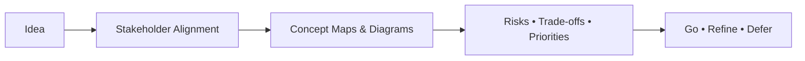
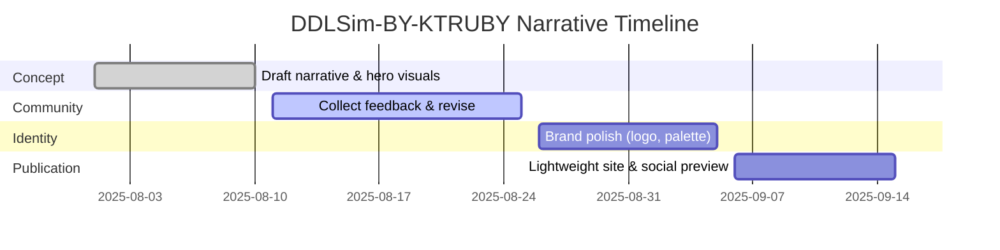

<!-- ========================= -->
<!--      DDLSim-BY-KTRUBY     -->
<!-- ========================= -->

  <!-- Temporary placeholder logo (replace later with your own asset) -->
  

<h1 align="center">DDLSim-BY-KTRUBY</h1>

<i>A high-level concept for a Distributed Deep Learning Infrastructure Simulator</i>

  <!-- Ready-made badges (no local images required) -->
  
  
  
  
  

  <!-- Visual tech strip — generic brand-safe badges (purely visual) -->
  
  
  

---

## Overview

**DDLSim-BY-KTRUBY** is an **open-source conceptual project** that presents a **clear, non-technical overview** of how teams might plan and communicate a simulation of distributed AI training environments—**without** implementation details or runnable code.

The goal is to help teams **align on the big picture**, discuss potential risks and priorities, and share a **professional, visual summary** before committing resources.

> This repository focuses on **ideas, visuals, and narrative only**.  
> It **does not** include executable code, scripts, or setup instructions.

---

## Vision

- **Simplify complexity** — turn large-scale training concepts into elegant visuals and plain language.  
- **Enable planning** — provide a friendly artifact for discussions with research leads, committees, and partners.  
- **Look professional** — use polished badges, placeholders, and a consistent visual identity out of the box.

---

## What This Project Is (and Isn’t)

**This project is:**
- A **concept deck** inside a README—visual, lightweight, easy to share.  
- A **communication aid** to describe intent, value, and audience.  
- A **starting point** for collecting feedback and aligning expectations.

**This project is not:**
- A technical manual, benchmark, or performance guide.  
- A collection of scripts, commands, or runnable examples.  
- An implementation reference for infrastructure or models.

---

## Why It Matters

- Creates a **shared language** between researchers, leadership, and stakeholders.  
- Supports **early decision-making** by clarifying goals and scope—without tech noise.  
- Delivers a **polished presence** for outreach, collaboration, and fundraising.

---

## Audience

- Research groups needing a **non-technical brief** to socialize an idea.  
- Academic programs explaining **distributed training concepts** at a high level.  
- Organizations seeking a **clean, visual summary** before committing resources.

---

## Concept at a Glance

> Conceptual diagram only—illustrative, not prescriptive.

---

## Visual Gallery (Placeholders)

  
   <em>A hero visual to introduce the project narrative</em>

  
   <em>High-level diagram sketch for storytelling</em>

  
   <em>Storyboard of potential scenarios to discuss value and risks</em>

> Replace these URLs later with your own images in `docs/assets/`.  
> Until then, these placeholders keep the page professional.

---

## Project Highlights (Non-Technical)

- **Clear narrative** — short sections and visuals to explain the big picture.  
- **Consistent identity** — ready-made badges and placeholders for immediate polish.  
- **Shareable format** — a single README you can send to anyone.  
- **Inclusive tone** — accessible to both technical and non-technical audiences.  
- **Living artifact** — designed to evolve as the concept matures.

---

## Values & Principles

- **Clarity over complexity**  
- **Openness to feedback**  
- **Respect for attribution**  
- **Sustainable, lightweight assets**

---

## Roles & Credits

- **Author / Project Lead:** *Kaitlyn Brishae Truby*  
- **Project Director:** *Mohammed Hleli* — outreach, stakeholder coordination, narrative refinement  
- **Contributors & Reviewers:** Community members (add names/handles as the project grows)

> Want to be listed here? Open an Issue titled **“Add me to Roles & Credits”** with a short line about your contribution.

---

## Timeline (Illustrative)

> Dates are placeholders—adjust as needed.

---

## Social Preview (Optional)

Add a social preview image to help your README look great when shared:

- Temporary preview:  
  `https://placehold.co/1200x630/111111/FFFFFF?text=DDLSim%20Concept%20Preview`

Later, upload a real preview via **Settings → Social preview**.

---

## Roadmap (Conceptual)

- Expand visual library (icons, diagrams, storyboards).  
- Add use-case narratives for education and outreach.  
- Provide a lightweight, static overview site (optional).  
- Collect collaborator feedback and refine content.  
- Prepare a one-page PDF brief for executive audiences.

> The roadmap stays **non-technical**; no code deliverables are planned here.

---

## Contribution Guidelines (Content-Only)

We welcome **content contributions** (no code):

1. Open an **Issue** describing your idea (e.g., “diagram: risk map”).  
2. Add assets (SVG/PNG/Markdown) in `docs/assets/` or `docs/sections/`.  
3. Submit a **Pull Request** referencing the Issue.

**Style tips**
- Prefer short paragraphs and meaningful headings.  
- Use neutral colors, high contrast, and accessible alt text for images.  
- Keep diagrams conceptual—avoid low-level details.

---

## FAQ (Non-Technical)

**Q: Is there runnable code?**  
A: No. This is a concept-only repository—visuals and narrative.

**Q: Can I adapt this for my team?**  
A: Yes. Fork it, replace placeholders, and keep the MIT license.

**Q: Where do I put my images later?**  
A: Add them under `docs/assets/` and update the links in this README.

---

## License & Legal

- **License:** MIT — see [`LICENSE`](LICENSE).  
- **Badges/Logos:** Third-party marks used via public badge services follow their respective brand guidelines.  
- **No Warranties:** This is a conceptual artifact provided “as is.”  
- **Attribution:** Please credit **DDLSim-BY-KTRUBY** when reusing text or visuals.

---

## Acknowledgements

Grateful to the open communities and educators who inspire accessible, visual storytelling for complex systems.

---

## Contact

- General questions: open an **Issue** with a clear title.  
- Collaboration & outreach: mention **@Kaitlyn-Brishae-Truby** and **@Mohammed-Hleli** in your Issue or PR.

---

> **TL;DR:** A polished, high-level concept README to communicate the idea of a distributed AI training simulator—**no code, no setup, just a clean narrative and visuals** for alignment and planning.
